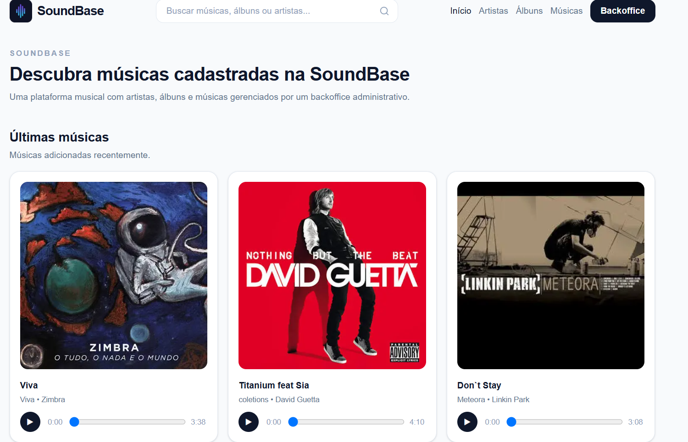
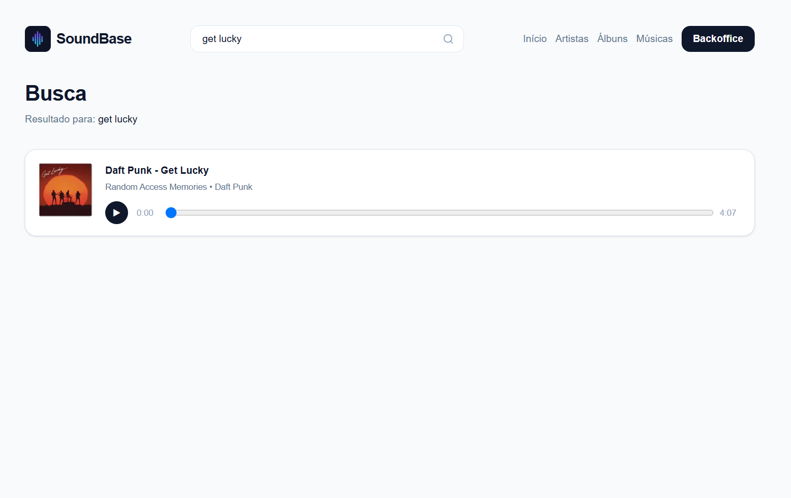
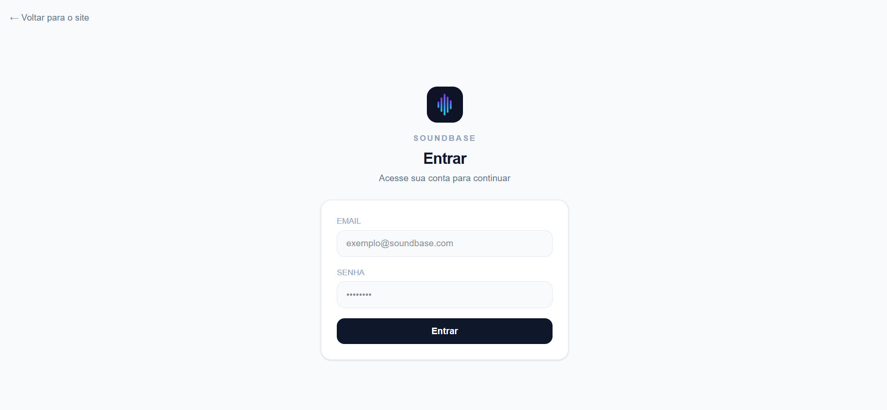
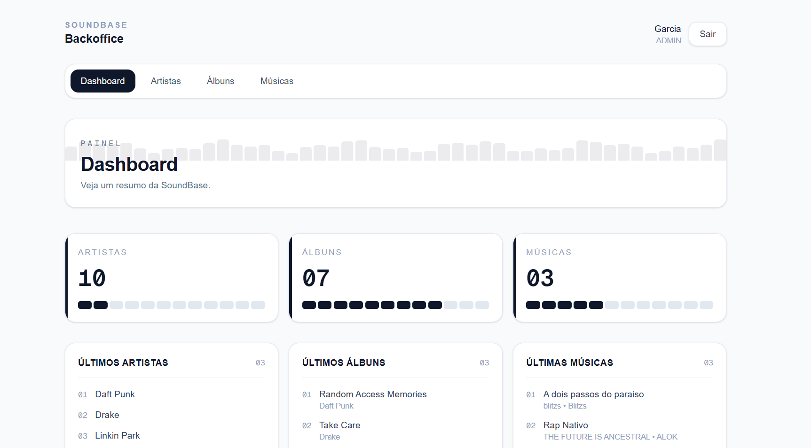
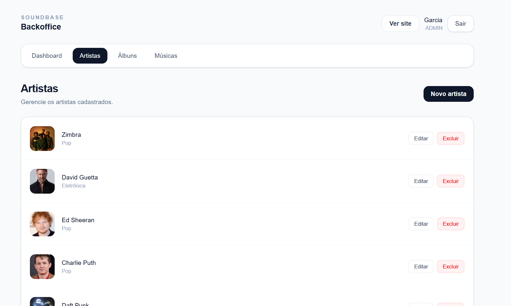
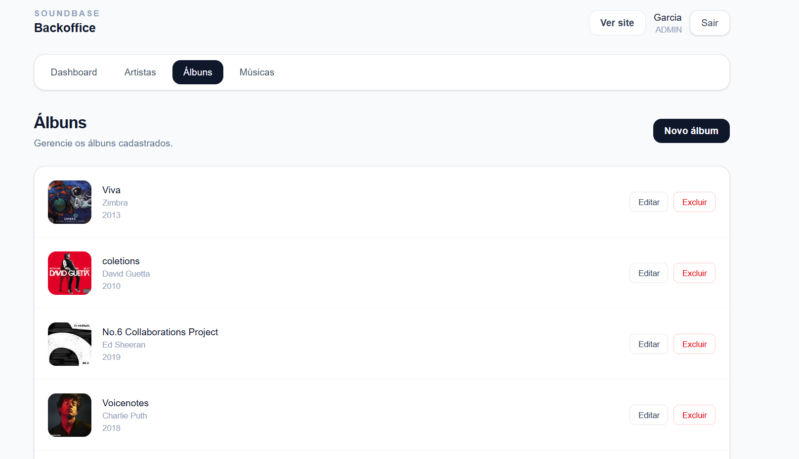
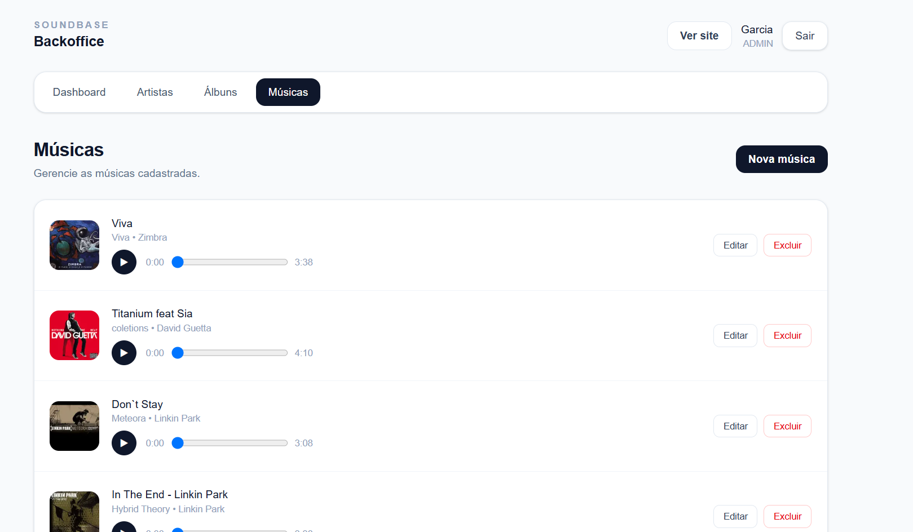
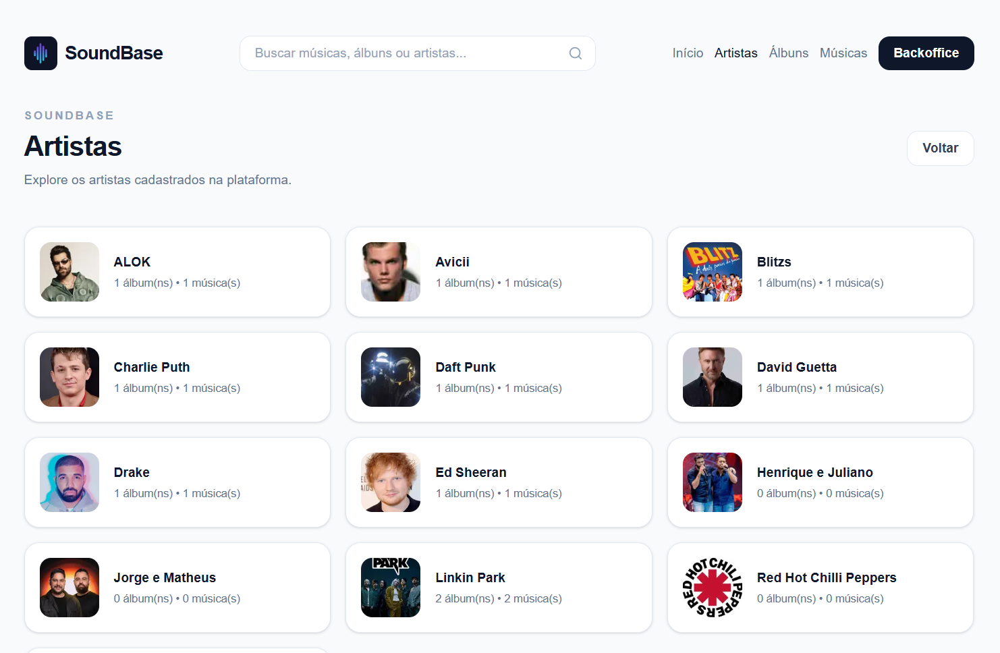
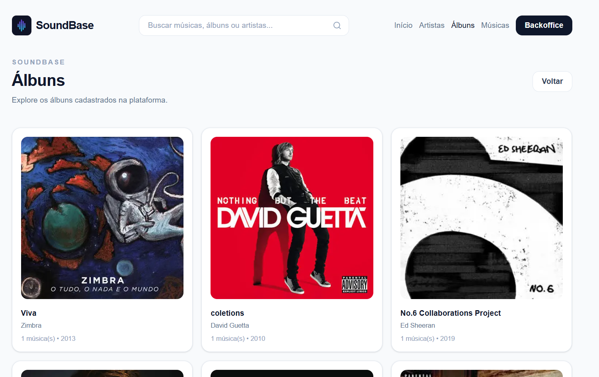
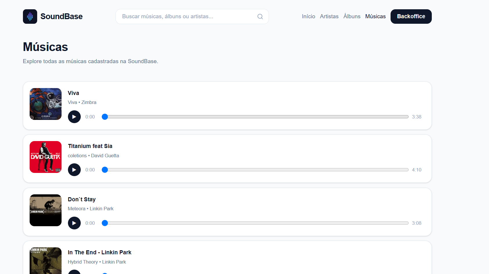

# SoundBase

SoundBase é uma aplicação full stack para gerenciamento musical, desenvolvida por Pedro Henrique Garcia com Next.js, Prisma, PostgreSQL, Docker, NextAuth, Neon PostgreSQL e Vercel Blob.

O projeto conta com um backoffice administrativo para gerenciar artistas, álbuns e músicas, além de uma interface pública para navegação, busca e reprodução das músicas cadastradas.

## Links

- Deploy: https://soundbase-nine.vercel.app/
- Repositório: https://github.com/pedrogarciaphgs/soundbase
- Autor: Pedro Henrique Garcia
- LinkedIn: https://www.linkedin.com/in/pedrogarciaphgs

## Tecnologias

- Next.js 15
- React 19
- TypeScript
- Prisma ORM
- PostgreSQL
- Neon PostgreSQL
- Docker
- NextAuth
- Tailwind CSS
- Zod
- React Hot Toast
- Vercel
- Vercel Blob

## Funcionalidades

### Backoffice

- Login com NextAuth Credentials
- Proteção de rotas administrativas por role `ADMIN`
- Proteção das Server Actions por role `ADMIN`
- Dashboard com estatísticas
- CRUD de artistas
- CRUD de álbuns
- CRUD de músicas
- Upload de imagens com Vercel Blob em produção
- Upload de áudio com Vercel Blob em produção
- Upload local em ambiente de desenvolvimento
- Player de áudio no backoffice
- Validação de formulários com Zod
- Feedback visual com toast
- Seed de usuário admin e dados demo

### Interface pública

- Home pública com últimas músicas cadastradas
- Listagem pública de artistas
- Página pública de detalhes do artista
- Listagem pública de álbuns
- Página pública de detalhes do álbum
- Listagem pública de músicas
- Página pública de detalhes da música
- Player de áudio reutilizado na interface pública
- Busca por músicas, álbuns e artistas
- Navegação pública com links para Início, Artistas, Álbuns, Músicas e Backoffice

## Screenshots

### Home pública



### Busca



### Login



### Dashboard



### Backoffice - Artistas



### Backoffice - Álbuns



### Backoffice - Músicas



### Interface pública - Artistas



### Interface pública - Álbuns



### Interface pública - Músicas



> As imagens acima mostram o fluxo público e administrativo da aplicação.

## Estrutura principal

```txt
src/
  app/
    dashboard/
      artists/
      albums/
      songs/
    artists/
    albums/
    songs/
    search/
  components/
    artists/
    albums/
    songs/
    dashboard/
    public/
  lib/
  services/
  utils/
prisma/
  schema.prisma
  seed.ts
```

## Arquitetura

O projeto segue uma separação simples entre interface, regras de aplicação e acesso ao banco.

- `app/`: rotas, páginas e Server Actions do Next.js
- `components/`: componentes reutilizáveis de interface
- `services/`: funções responsáveis por acessar o banco com Prisma
- `utils/`: helpers reutilizáveis, como autenticação e upload
- `prisma/`: schema, migrations e seed do banco

As páginas administrativas são protegidas por autenticação com NextAuth e validação de role `ADMIN`.

As operações de criação, edição e exclusão são feitas por Server Actions, com validação usando Zod antes de persistir os dados no banco.

## Decisões técnicas

- O projeto foi estruturado primeiro como um backoffice administrativo, responsável por alimentar e gerenciar os dados musicais.
- A interface pública/client consome os dados cadastrados pelo painel administrativo.
- As operações administrativas usam Server Actions do Next.js.
- O acesso ao banco foi isolado em services, mantendo as páginas e actions mais organizadas.
- A autenticação usa NextAuth com Credentials Provider.
- O acesso ao backoffice é restrito a usuários com role `ADMIN`.
- As Server Actions também validam permissão de administrador antes de criar, editar ou excluir dados.
- Os formulários usam Zod para validação antes da persistência.
- Os uploads são armazenados localmente em ambiente de desenvolvimento.
- Em produção, os uploads são armazenados com Vercel Blob.
- Os arquivos enviados usam UUID no nome para evitar conflitos.
- As URLs públicas dos arquivos são salvas no banco de dados.

## Uploads

O projeto possui upload de imagens e arquivos de áudio pelo backoffice.

Validações implementadas:

- Imagens: PNG, JPG ou JPEG
- Áudios: MP3, WAV ou OGG
- Limite de imagem: 4MB em produção
- Limite de áudio: 4MB em produção
- Arquivos salvos com UUID para evitar conflito de nomes

Em ambiente de desenvolvimento, os uploads podem ser salvos localmente em `public/uploads`.

Em produção, os uploads são armazenados com Vercel Blob, e as URLs públicas retornadas pelo storage são persistidas no banco de dados.

## Deploy

O projeto está publicado na Vercel.

Para produção, foram configurados:

- Deploy da aplicação na Vercel
- Banco PostgreSQL hospedado no Neon
- Variáveis de ambiente configuradas na plataforma de deploy
- `NEXTAUTH_URL` apontando para a URL final da aplicação
- `NEXTAUTH_SECRET` seguro e exclusivo do ambiente de produção
- Storage externo com Vercel Blob para imagens e áudio

Para produção, use o arquivo `.env.production.example` como referência para configurar as variáveis de ambiente na plataforma de deploy.

As migrations em produção devem ser aplicadas com:

```bash
npm run prisma:migrate:deploy
```

## Como executar o projeto

### 1. Clonar o repositório

```bash
git clone git@github.com:pedrogarciaphgs/soundbase.git
cd soundbase
```

### 2. Criar o arquivo `.env`

Copie o arquivo de exemplo:

```bash
cp .env.example .env
```

No Windows PowerShell:

```bash
Copy-Item .env.example .env
```

Depois edite o `.env` com suas credenciais locais.

### 3. Subir o projeto com Docker

```bash
docker compose up --build
```

A aplicação ficará disponível em:

```txt
http://localhost:3000
```

### 4. Rodar as migrations

Em outro terminal, execute:

```bash
npx prisma migrate dev
```

### 5. Rodar o seed

```bash
npx prisma db seed
```

O seed cria um usuário administrador demo para acesso local:

```txt
E-mail: garcia.admin@soundbase.com
Senha: admin123
```

> Essas credenciais são apenas para ambiente local de desenvolvimento.

### 6. Acessar o backoffice

Depois do login, acesse:

```txt
http://localhost:3000/dashboard
```

Rotas principais:

```txt
/dashboard
/dashboard/artists
/dashboard/albums
/dashboard/songs
```

Rotas Públicas:

```txt
/
/artists
/artists/[id]
/albums
/albums/[id]
/songs
/songs/[id]
/search?q=termo
```

### 7. Abrir o Prisma Studio

Para visualizar os dados do banco:

```bash
npx prisma studio
```

## Observações

Em desenvolvimento, os arquivos podem ser armazenados localmente em:

```txt
public/uploads

```

Em produção, essa camada pode ser substituída por um serviço externo de storage como S3, Cloudinary ou R2.

## Status do projeto

Projeto publicado e funcional.

Próximas etapas planejadas:

- Melhorias na interface pública
- Filtros avançados
- Melhorias de responsividade no backoffice
- Página de perfil/admin
- Melhorias no player de áudio

## Autor

Desenvolvido por Pedro Henrique Garcia.

- GitHub: https://github.com/pedrogarciaphgs
- LinkedIn: https://www.linkedin.com/in/pedrogarciaphgs
